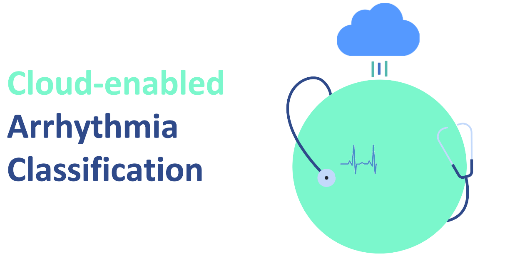

# Cloud Native ECG Classification
<!--
*** Thanks for checking out the Best-README-Template. If you have a suggestion
*** that would make this better, please fork the repo and create a pull request
*** or simply open an issue with the tag "enhancement".
*** Thanks again! Now go create something AMAZING! :D
***
***
***
*** To avoid retyping too much info. Do a search and replace for the following:
*** github_username, repo_name, twitter_handle, email, project_title, project_description
-->


<!-- PROJECT SHIELDS -->
<!--
*** I'm using markdown "reference style" links for readability.
*** Reference links are enclosed in brackets [ ] instead of parentheses ( ).
*** See the bottom of this document for the declaration of the reference variables
*** for contributors-url, forks-url, etc. This is an optional, concise syntax you may use.
*** https://www.markdownguide.org/basic-syntax/#reference-style-links

[![Contributors][contributors-shield]][contributors-url]
[![Stargazers][stars-shield]][stars-url]
[![Issues][issues-shield]][issues-url]
-->

<!-- PROJECT LOGO -->
<br />
<p align="center">
  <a href="https://github.com/ParthenopeCloudTeam/CloudNativeECG-Classification">
    
  </a>

  <h3 align="center">Abstract</h3>

  <p align="justify">
Inserire abstract
    <br />
</p>


<!-- TABLE OF CONTENTS -->
<details open="open">
  <summary><h2 style="display: inline-block">Table of Contents</h2></summary>
  <ol>
    <li>
      <a href="#about-the-project">About The Project</a>
      <ul>
        <li><a href="#proposed-models">Proposed Models</a></li>
      </ul>
      <ul>
        <li><a href="#frameworks">Frameworks</a></li>
      </ul>
    </li>
    <li>
      <a href="#getting-started">Getting Started</a>
      <ul>
        <li><a href="#code-structure">Code structure</a></li>
      </ul>
      <ul>
        <li><a href="#dataset-structure">Dataset structure</a></li>
      </ul>
    </li>
    <li><a href="#contacts">Contacts</a></li>
    <li><a href="#acknowledgements">Acknowledgements</a></li>
  </ol>
</details>


<!-- ABOUT THE PROJECT -->
## About The Project

<p align="justify">
In this project we aim to develope a cloud native solution for real-time arrhythmia classification. The deep learning core is heavily inspired by
[this paper](https://www.nature.com/articles/s41591-018-0268-3) with the addition of one classification stage; at first we check if the ecg signal contains noise, then we forward it to a 4 classes CNN which classifies different arrhythmias. As for the cloud native point of view, the entire architecture is split into three stateless microservices.
  
</p>

### Proposed models

<p align="justify">
We employed two CNN architectures
</p>


### Reconstruction error
Illustration of different learning behaviours in the movements with MSE and MAE. 
<p align="center">
    
    <br>
</p>

### Frameworks

* [Keras/Tensorflow 2.0](https://www.tensorflow.org/)
* [Python 3.7](https://www.python.org/downloads/release/python-370/)
* [Openpose](https://github.com/CMU-Perceptual-Computing-Lab/openpose)


<!-- GETTING STARTED -->
## Getting Started

Istructions for code and data are down below.


<!-- CODE STRUCTURE -->
### Code structure

```
src
├── draw_skeletons.py
│   ──> contains procedures for generating images/videos from skeleton data
├── preprocessing.py
│   ──> contains all the preprocessing functions
├── model_and_training.py
│   ──> contains the model architectures and training procedure
├── evaluation.py 
│   ──> contains all the metrics and functions used for evaluating the model
```

<!-- DATASET STRUCTURE -->
### Dataset structure

<p align="justify">
Before training, you have to set up the dataset directory in a precise manner. The preprocessing stage takes two different datasets, the train set and the test set. Each one is a directory of directories, and the preprocessing procedure scans every directory in alphabetical order or the order speicified in the code (the order of the list of string that represents the name of directories), collecting all the json.
</p>

```
Dataset
├── Train-Set
│   ├── Dir_1
│   │   └── json data
│   ├── ...
│   │   └── ...
│   └── Dir_N
│       ├── json data
├── Test-Set
│   ├── Dir_1
│   │   └── json data
│   ├── ...
│   │   └── ...
│   └── Dir_N
│       ├── json data
```

<!-- CONTACT -->
## Contacts

* Andrea: [LinkedIn][linkedin-andrea-url]
* Antonio: [LinkedIn][linkedin-antonio-url]


<!-- ACKNOWLEDGEMENTS -->
## Acknowledgements

* [Thomas Gatt](https://ieeexplore.ieee.org/document/8868795)


<!-- MARKDOWN LINKS & IMAGES -->
<!-- https://www.markdownguide.org/basic-syntax/#reference-style-links -->
[contributors-shield]: https://img.shields.io/github/contributors/github_username/repo.svg?style=for-the-badge
[contributors-url]: https://github.com/ParthenopeDeepTeam/Fall-Detection-using-LSTM-Autoencoder/graphs/contributors
[stars-shield]: https://img.shields.io/github/stars/github_username/repo.svg?style=for-the-badge
[stars-url]: https://github.com/github_username/repo/stargazers
[issues-shield]: https://img.shields.io/github/issues/github_username/repo.svg?style=for-the-badge
[issues-url]: https://github.com/ParthenopeDeepTeam/Fall-Detection-using-LSTM-Autoencoder/issues
[linkedin-shield]: https://img.shields.io/badge/-LinkedIn-black.svg?style=for-the-badge&logo=linkedin&colorB=555
[linkedin-andrea-url]: https://www.linkedin.com/in/andrea-lombardi/
[linkedin-antonio-url]: https://www.linkedin.com/in/antonio-junior-spoleto/
