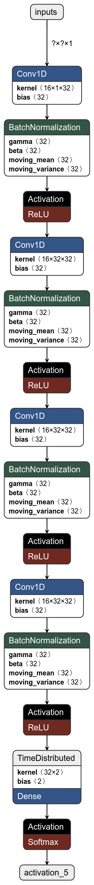
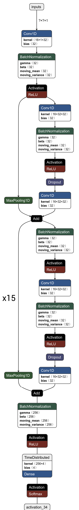
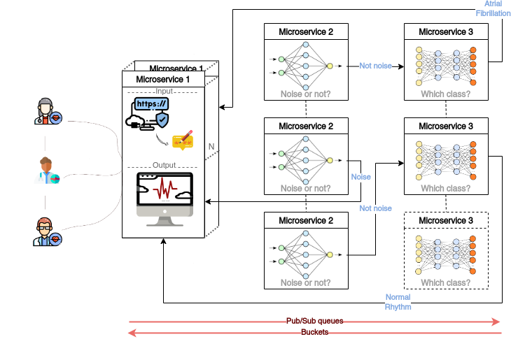

<div id="top">
  
<div align="center">
    <a href="https://docs.docker.com/">
        
    </a>
      <a href="https://cloud.google.com">
        
    </a>
      <a href="https://www.python.org/downloads/release/python-360/">
        
    </a>
      <a href="https://www.tensorflow.org/">
        
    </a>
      <a href="https://keras.io/">
        
    </a>
        <a href="https://flask.palletsprojects.com/en/2.1.x/">
        
    </a>
        <a href="https://gunicorn.org/">
        
    </a>
    <a href="https://github.com/ParthenopeCloudTeam/CloudNativeECG-Classification">
        
    </a>
  </div>
</div>

# Cloud Native Arrhythmia Classification
<!--
*** Thanks for checking out the Best-README-Template. If you have a suggestion
*** that would make this better, please fork the repo and create a pull request
*** or simply open an issue with the tag "enhancement".
*** Thanks again! Now go create something AMAZING! :D
***
***
***
*** To avoid retyping too much info. Do a search and replace for the following:
*** github_username, repo_name, twitter_handle, email, project_title, project_description
-->


<!-- PROJECT SHIELDS -->
<!--
*** I'm using markdown "reference style" links for readability.
*** Reference links are enclosed in brackets [ ] instead of parentheses ( ).
*** See the bottom of this document for the declaration of the reference variables
*** for contributors-url, forks-url, etc. This is an optional, concise syntax you may use.
*** https://www.markdownguide.org/basic-syntax/#reference-style-links

[![Contributors][contributors-shield]][contributors-url]
[![Stargazers][stars-shield]][stars-url]
[![Issues][issues-shield]][issues-url]
-->

<!-- PROJECT LOGO -->
<br />
<p align="center">
  <a href="https://github.com/ParthenopeCloudTeam/CloudNativeECG-Classification">
    
  </a>

  <h3 align="center">Abstract</h3>

  <p align="justify">
<i>
Nowdays, cardiological tools are only capable of offering a statistical report which does not offer valuable help to recognize common arrhythmias. Furthermore, existing AI-driven solutions require in-house implementation and constant maintenance. 
This paper presents a cloud native application running on Google Cloud Platform which provides an intuitive web interface. In this way, continuous management is decoupled from the public structure altogether, making the cloud approach more appealing. 
Having an always available deep learning solution for heart diseases analysis can be useful for a quick and preemptive patient examination before the actual medical input.
Our contribution is the development of a cloud native solution, making the service highly scalable and resilient, as opposed to in-house configurations.
We propose a three stateless microservices architecture that hierarchically manages the data flow and the inference, the latter being carried on by a two stage neural network which firstly handles the noise separation and secondly the classification. 
We run benchmarks on both our cloud solution and a local hosted equivalent to assess scalability and performance differences.
</i>
    <br />
</p>


<!-- TABLE OF CONTENTS -->
<details open="open">
  <summary><h2 style="display: inline-block">Table of Contents</h2></summary>
  <ol>
    <li>
      <a href="#about-the-project">About The Project</a>
      <ul>
        <li><a href="#proposed-models">Proposed Models</a></li>
      </ul>
      <ul>
        <li><a href="#cloud-technologies">Cloud Technologies</a></li>
      </ul>
      <ul>
        <li><a href="#frameworks">Frameworks</a></li>
      </ul>
    </li>
    <li>
      <a href="#getting-started">Getting Started</a>
    </li>
    <li>
      <a href="#contacts">Contacts</a>
    </li>
    <li>
      <a href="#acknowledgements">Acknowledgements</a>
    </li>
  </ol>
</details>


<!-- ABOUT THE PROJECT -->
## About The Project

<p align="justify">
In this project we aim to develope a cloud native solution for real-time arrhythmia classification. We took inspiration from the deep learning model presented in
<a href=https://www.nature.com/articles/s41591-018-0268-3>this paper</a>  with the addition of an extra classification stage; at first, our model looks for the presence of noise in an input ecg signal. If said signal is clean, it will be further evaluated in another stage, where our model classifies the signal in four possible classes of arrythmia. The cloud architecture consists of three stateless microservices capable of communicating with each other.
</p>

### Proposed models

<p align="justify">
The ECG arrhythmia detection task is a sequence-to-sequence task which takes as input an ECG signal $x = [x_1 \ldots x_k]$ and outputs a sequence of labels $r = [r_1 \ldots r_k]$, such that each $r_i$ can take on one of $m$ different rhythm classes. Each output label corresponds to a segment of the input. Together the output labels cover the full sequence. However, this phase is executed after a preliminary classification step, which aims to look for noise presence in the signal.
We use a convolutional neural network for both the binary and the sequence-to-sequence learning task. The networks take as input a time-series of raw ECG signal, and output a binary and a sequence of labels predictions, respectively.
The models are structured as follows (model graphs generated with <a href=https://github.com/lutzroeder/netron> this tool</a>):
<p align="center">
    
    &nbsp;&nbsp;&nbsp;&nbsp;&nbsp;&nbsp;&nbsp;&nbsp;&nbsp;&nbsp;
    
    <br>
</p>
</p>

### Cloud Technologies
We opted to use a Platform-as-a-Service (PaaS) as it offers a ready-to-use cost efficient solution with the caveat of having less fine tuned control.
The PaaS of our choice is Google Cloud Platform, as it offers a plethora of services for developers. The most crucial one being Google Cloud Run,
a serverless model that can run and automatically manage containers thanks to the under the hood Kubernetes layer. This setup perfectly fits our needs
of an autoscaling and on-demand server infrastructure. Furthermore, Cloud Run can be configured to support multiple concurrent requests on a single container instance which allows us to save time and cost.
We built three containers for our app through the usage of Docker. Each container holds a microservice which is then deployed to a GCR service.
Microservices are an architectural style for developing applications: they allow a large application to be decomposed into independent constituent parts, with each part having its own realm of responsibility. 
This leads to simpler scalability and optimization, which is exactly what we are looking for. The microservices communicate with each other in a feed-forward fashion thanks to the pub/sub protocol in conjunction with the usage of Eventarc triggers. 
The aforementioned approach decouples clients from the server (they won't need to wait for the receiver to be available), and this separation is further enhanced by triggers' way of message delivery: the push method. 
Clients will receive messages as soon as they are ready, without the necessity of a synchronous wait.
<p align="center">

</p>


<!-- PREREQUISITES-->
### Prerequisites
* Install [Docker](https://docs.docker.com/engine/install/ubuntu/)
* Follow this guide (https://cloud.google.com/docs/authentication/production) to authenticate the application as a service account 
* Go to the folder of each microservice and then run next commands. This will ensure that all the required libraries will be installed 
  ```
    docker build -t /gcr.io/project_name/name_of_image .
  ```
  ```
    docker push /gcr.io/project_name/name_of_image
  ```
* Go to Google Pub/Sub and create ecg and nonNoise-ecg topics 
* Go to Google Cloud Run and create the corrisponding services from the images you just pushed
* Follow this guide (https://cloud.google.com/eventarc/docs/creating-triggers?hl=en) to create Eventarc triggers for m2 and m3 services
  - Select the event provider Pub/Sub and choose Message.Published event 

<!-- GETTING STARTED -->
## Getting Started
```
├── M1
│   ──> contains web interface src code
├── M2
│   ──> contains Noise/non-Noise binary classifier src code
├── M3
│   ──> contains Arrhythmia classifier src code
```
The configuration we used for the m2 and m3 services is the following:
<ul>
  <li> 4 CPUs and 4 GBs of RAM </li>
  <li> Number of maximum requests per container: 3 </li>
  <li> Allow internal traffic and traffic from Cloud Load Balancing </li>
  <li> Authentication: Require authentication </li>
</ul> 
For m1 service we used :
<ul>
  <li> 2 CPUs and 2 GBs of RAM </li>
  <li> Number of maximum requests per container: 6 </li>
  <li> Allow all traffic </li>
  <li> Authentication: Allow unauthenticated invocations </li>
</ul> 

Once the services are created, click on the generated m1 url to access to the web interface<!-- CONTACT -->
## Contacts

* Marco Di Lullo - marcodilullo2714@gmail.com - [LinkedIn](https://www.linkedin.com/in/marco-di-lullo-32a9241a2) 
* Salvatore Alberto Gicchino - g.salvatore93@gmail.com  - [LinkedIn](https://www.linkedin.com/in/salvatore-gicchino-189566238)
* Antonio Junior Spoleto - spoletoantoniojr@gmail.com
* Maria Concetta Vitale - cvitale819@gmail.com 

<!-- ACKNOWLEDGEMENTS -->
## Acknowledgements
We are grateful for the support of the University of Naples “Parthenope”, Department of Science and Technologies, Research Computing Facilities ([link](https://rcf.uniparthenope.it)) for assistance with the calculations carried out in this work.


<!-- MARKDOWN LINKS & IMAGES -->
<!-- https://www.markdownguide.org/basic-syntax/#reference-style-links -->

